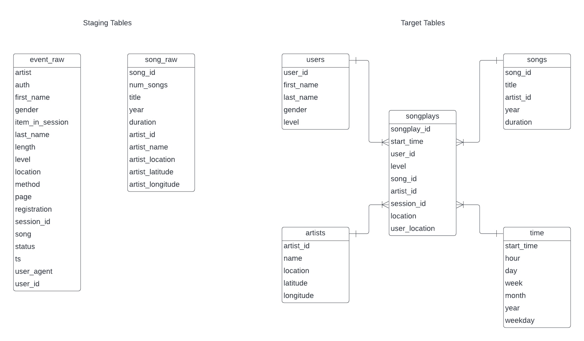

# Udacity-DEND-5-Data-Pipelines-Airflow

# Udacity Data Pipelines with Airflow Project

## Introduction

The aim of this project is to use Apache Airflow to further automate data pipelines for a music streaming service (Sparkify). This is a music streaming service who have user activity along with song data and wish to further exploit their users. A DAG was to be configured and task dependencies were set. Custom operators were built to manage the core data tasks in this process. This project is performed using Amazon S3 and Amazon Redshift along with Apache Airflow.

## How to Run

1. Establish an Amazon Redshift cluster where public access is allowed and inbound and outbound traffic is possible from worldwide.
2. Create Connections in Apache Airflow to connect to a Redshift cluster (redshift) and provide the Amazon user data(aws_credentials).
3. Run the dag (p5_airflow_27) in Apache Airflow

**Notes:**  
If errors are encountered, drop all tables (especially users) and rerun the dag

## File Introduction
### Datasets

#### Song data  
A subset of the million song dataset.  
JSON files containing song and artist metadata.  
First 3 letters of track ID is used for partitioning the data
#### Log Data
JSON files contianing simulated user activity data.  
year and month used to partition data.

## Schema and ETL

The ER diagram corresponding to the Staging Tables and Star Schema used in the current project is show above.  
The songplays fact table acts as a convenient and logical node between the given dimension tables.  
The dimension tables are well defined and separated allowing for a high degree of flexibility.  

The raw data is loaded from the S3 bucket to the song_raw and event_raw staging tables.
Data required for each of the target tables is extracted, transformed as required and loaded to the appropriate table.
Songplay records are extracted and completed with the aid of the event_raw and song_raw tables.  

